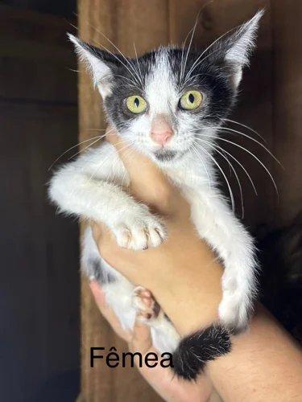
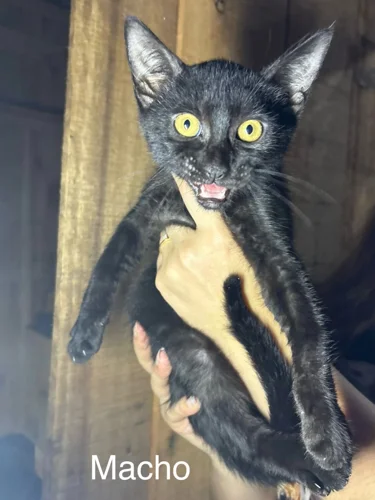
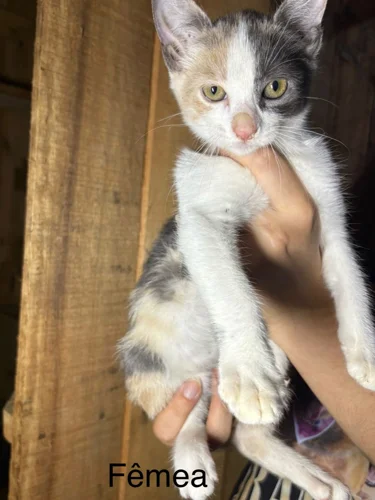
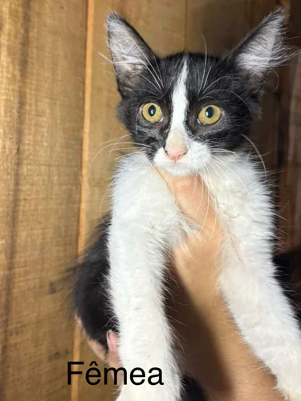
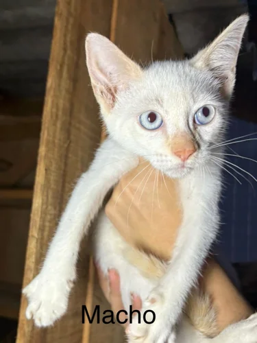
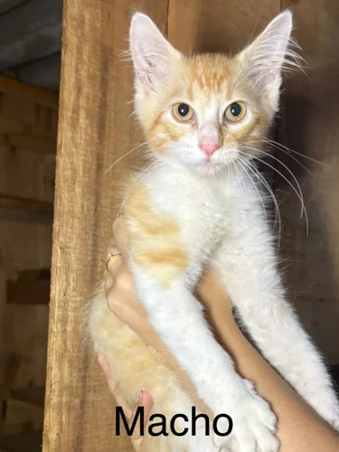
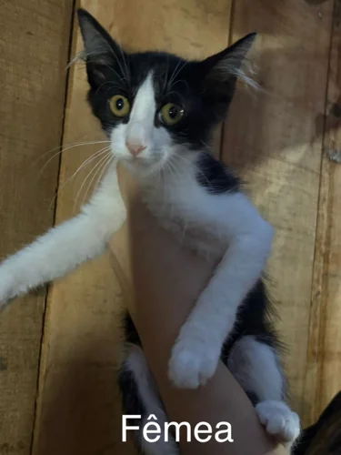
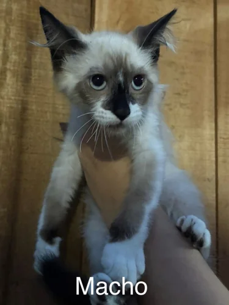
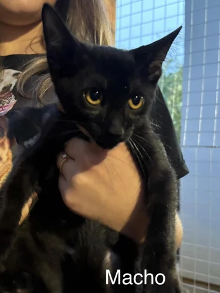
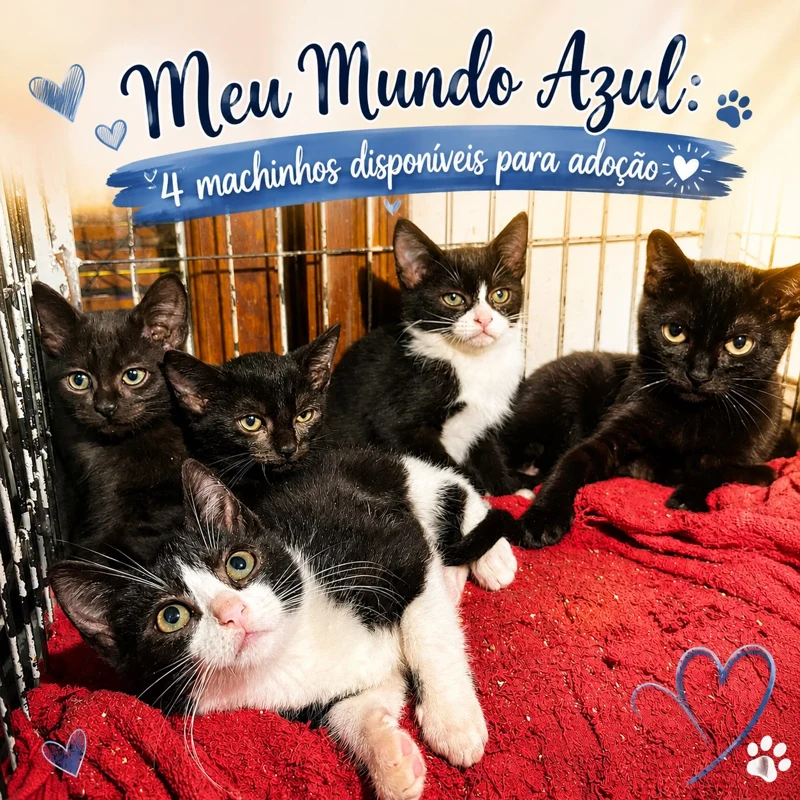

# Pendências de identificação e disponibilidade

Estas imagens foram revisadas, mas não permitem criar fichas individuais confiáveis sem informação adicional da cliente. Não são perfis disponíveis publicados no site.

## Nove imagens de 30/12/2025

[Publicação original](https://www.instagram.com/p/DS3uRQUjFJx/) informa gatos de cerca de 3–4 meses disponíveis para adoção naquele momento. Os nomes não aparecem; há fotos possivelmente repetidas. Os números abaixo identificam imagens, não animais distintos. É necessário informar o nome correspondente a cada imagem e quais são do mesmo animal.

| Imagem | Sexo escrito na imagem | Referência                                                  |
| ------ | ---------------------- | ----------------------------------------------------------- |
| 01     | Fêmea                  |  |
| 02     | Macho                  |  |
| 03     | Fêmea                  |  |
| 04     | Fêmea                  |  |
| 05     | Macho                  |  |
| 06     | Macho                  |  |
| 07     | Fêmea                  |  |
| 08     | Macho                  |  |
| 09     | Macho                  |  |

## Quatro machinhos de 11/06/2026

[Publicação original](https://www.instagram.com/p/DZc4oz3u6yl/). A legenda informa quatro filhotes machos que já comem ração. A montagem inclui a mãe e não associa nomes a cada filhote. Precisamos dos nomes e da correspondência nas fotos, além da disponibilidade atual.

## Tratamentos e vídeos

| Nomes ou grupo                                          | O que falta                                                                                                                                | Fonte                                                                                                  |
| ------------------------------------------------------- | ------------------------------------------------------------------------------------------------------------------------------------------ | ------------------------------------------------------------------------------------------------------ |
| Alemão, Fumaça, Amora, Joaquim e Mufasa                 | Associação segura entre nome e foto individual e confirmação de liberação para adoção; as cartinhas relatam tratamento para esporotricose. | [Cartinhas, slides 15 e 16](https://www.instagram.com/p/DSaIoTwjsZQ/?img_index=15)                     |
| Meia Noite                                              | Confirmação da evolução após internação e eventual liberação para adoção.                                                                  | [27/05/2026](https://www.instagram.com/p/DY0y0cxO8C3/)                                                 |
| Dulce Maria                                             | Tratamento de pele em curso no post; confirmar se busca família.                                                                           | [04/04/2026](https://www.instagram.com/p/DWtn2Rgjo2j/)                                                 |
| Pantera, Aveia e Mel                                    | O download contém a capa de um vídeo, sem fotos individuais identificáveis. Confirmar também se estão para adoção.                         | [18/07/2026](https://www.instagram.com/p/Da8psLwh6eY/)                                                 |
| Pirata                                                  | Foto do gato e confirmação de disponibilidade; a imagem baixada é a capa de vídeo com uma pessoa.                                          | [04/09/2026](https://www.instagram.com/p/Dc3sqzMR7rs/)                                                 |
| Gatinha resgatada do fosso / resgate coletivo de Guaíba | Nomes, fotos individuais e conclusão da avaliação para adoção.                                                                             | [Fosso](https://www.instagram.com/p/DWYscc0jgwN/) · [Guaíba](https://www.instagram.com/p/Da3mcdxxByL/) |

## Nove situações conflitantes já sinalizadas no site

Orquídea, Snow, Bombom, Hera, Zeus, Coxinha, Kibe, Margot e Olga têm legenda individual marcando adoção e cartinhas de dezembro de 2025 indicando busca por família. Bombom tem relato explícito de devolução na cartinha. A data de edição das legendas não está disponível, então a data original do post não resolve a sequência dos fatos. Permanecem na aba “Situação a confirmar”, com contato pelo Instagram.

A [revisão completa](REVIEW.md) preserva a legenda e a decisão de todos os 141 posts.
